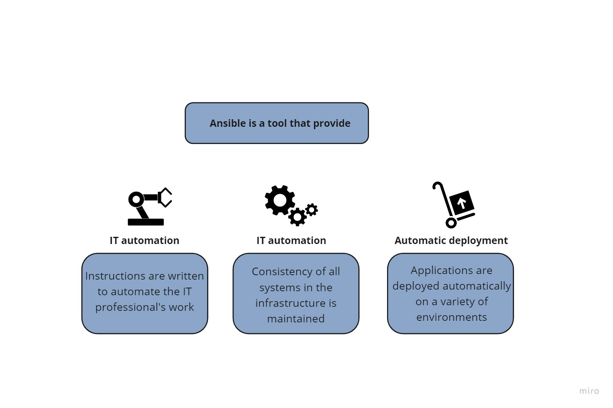
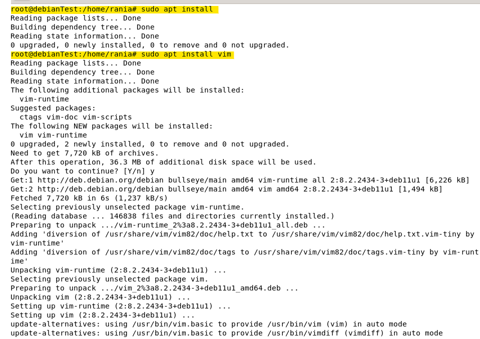
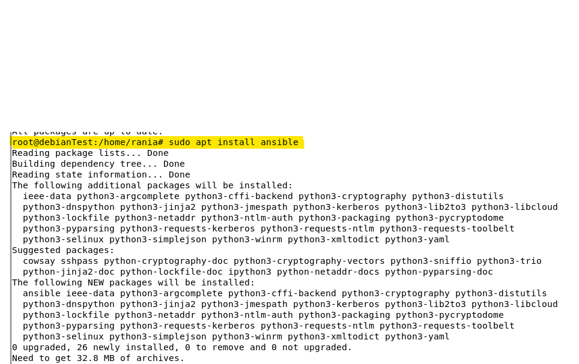
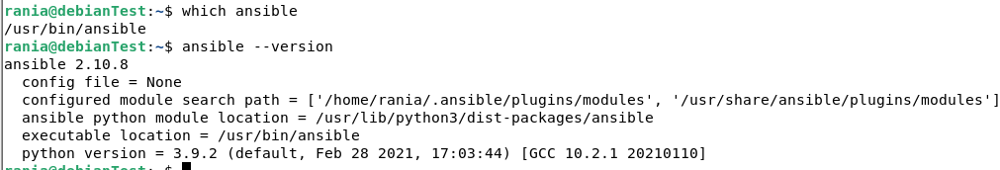
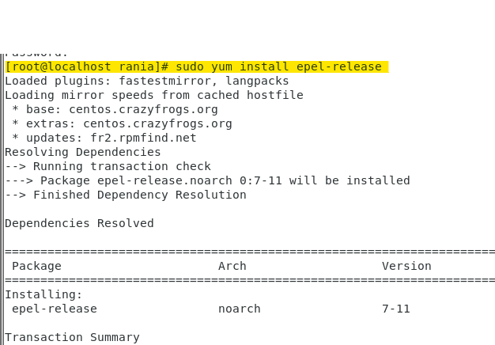
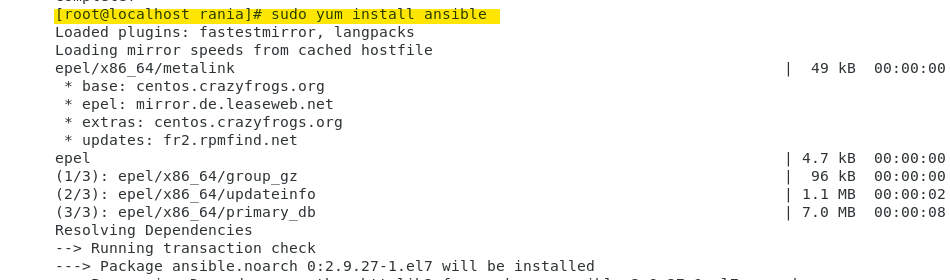
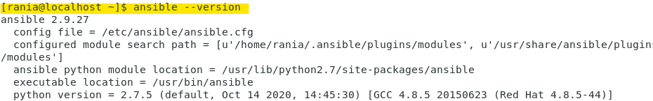
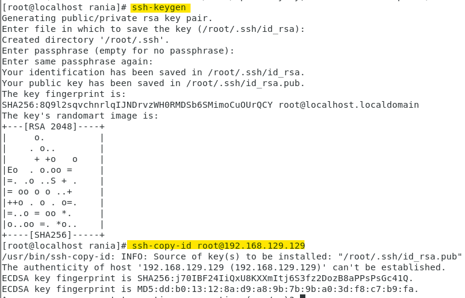
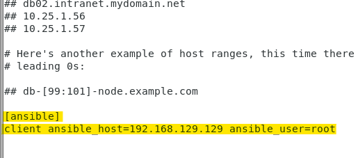
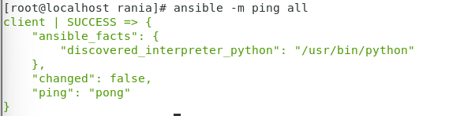

#Ansible :

- Ansible is an IT automation tool that automates configuration
  management, cloud provisioning, deployment and orchestration.

{width="4.934722222222222in" height="3.06875in"}
 - The core of Ansible playbooks are written in
   YAML. (Should really do a section on YAML as we have seen this a few times)

## Install and configure ansible on Debian 11 :**

By default, the Ansible package is not included in the Debian default
repository.

There are two ways to install Ansible on Debian 11.

-   Using apt command

-   Using pip command

And in this installation, we will choose the first option, first we
update the repository

***\$ Sudo apt install***

***\$ Sudo apt install vim***

{width="6.3in" height="4.454166666666667in"}

Then using apt command, install ansible in debian 11

***\$ sudo apt install ansible***

{width="6.3in" height="2.5166666666666666in"}

Once the Ansible is installed, we can determine the directory and verify
the Ansible version with the following command :

***\$ ansible \--version***

{width="6.099126202974628in"
height="1.3734601924759404in"}

##Install and configure ansible on CentOS 7 :**

#### Step 1 --- Installing Ansible

First, we have to check that the centos epel repository is installed
using this command :

***\$ sudo yum install epel-release***

{width="5.21711832895888in"
height="3.025262467191601in"}

Once the repository is installed, we can install ansible with yum:

***\$ sudo yum install ansible***

{width="5.966666666666667in"
height="1.8569444444444445in"}

{width="6.3in" height="0.9819444444444444in"}

#### Step 2 --- Configuring Ansible Hosts

To test Ansible, we need to generate an ssh key on my local machine,
once completed we have to copy the public key in client server by using
these commands

***\$ ssh-keygen***

***\$ ssh-copy-id root@192.168.129.129***

{width="6.3in" height="4.039583333333334in"}

Next we need to configure ansible hosts by adding the client server ip

***vi /etc/ansible/hosts***

{width="4.292038495188102in"
height="1.8918307086614172in"}

To test the configuration, execute this command below and as you can see
our configuration is completely successful.

***\$ ansible -m ping all***

{width="5.017101924759405in"
height="1.2334405074365704in"}

\[1\]  **[centos guide](https://docs.ansible.com/ansible/latest/installation_guide/installation_distros.html#installing-ansible-on-fedora-or-centos)**.\bar 
\[2\] **[configuration docs](https://www.youtube.com/watch?v=cEnq94dYrSg&ab_channel=LinuxHelp)**.
