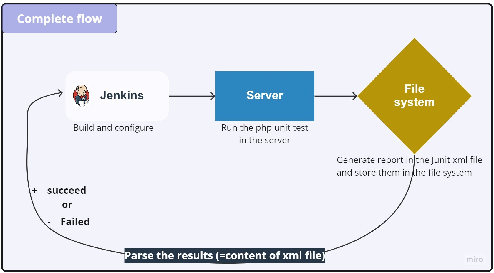
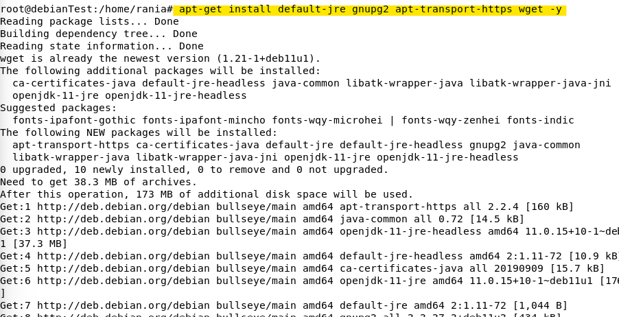
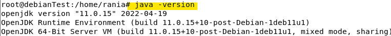
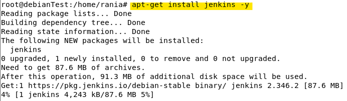
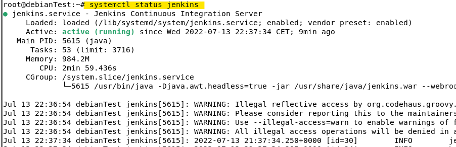
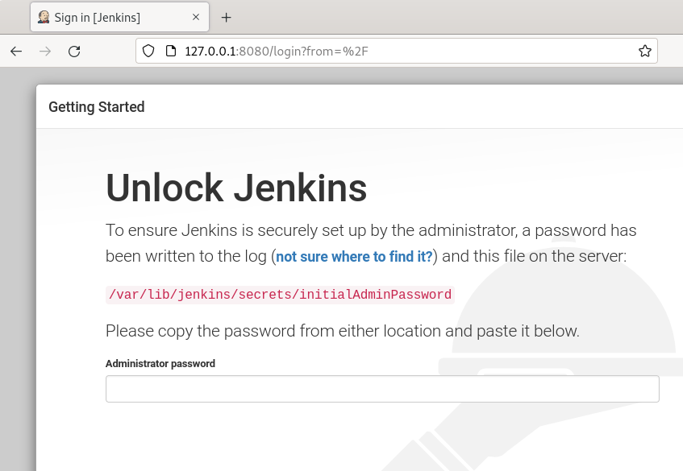

# Jenkins

## What is Jenkins?

Jenkins is an open-source automation tool is created using Java
programming language. For the initial setup, it facilitates users with
CI/CD (continuous integration (CI) or continuous delivery) technique
that simplifies the use and management of processes.

This figure represents the complete flow: from the build to the test a
job or a pipeline.

## Jenkins plugins:

Jenkins plugins work by creating or extending an extension point, which
hooks into a specific part of the build process.

The plugins configuration is usually stored in the form of an XML file
located inside the \$JENKINS_HOME root, which defines the structure and
settings that are mandatory for each plugin.

A new Jenkins item can be a job or a pipeline, so we can create project
that can Jenkins build for us.

We have two kinds of pipelines: declarative pipeline and scripted
pipeline.

## Installation of Jenkins on Debian:

Jenkins is a Java-based tool so Java must be installed in your system.
If not installed, you can install it using the following command:

## Step 1: Install java

***\$ apt-get install default-jre gnupg2 apt-transport-https wget -y***

Once the Java is installed, verify the Java version using the following
command:

***\$ java -version***

## Step 2: Add Jenkins PPA

First, download and add the GPG key, Next add the Jenkins PPA with the
following command:

***\$ wget <https://pkg.jenkins.io/debian-stable/jenkins.io.key>***

***\$ apt-key add jenkins.io.key***

## Step 3: Install Jenkins on Debian

Once Jenkins PPA has been added, you can update the repository cache
with the following command:

***\$ apt-get update -y***

Next, install the Jenkins with the following command:

***\$ apt-get install jenkins -y***

After the installation, verify the Jenkins status using this command:

***\$ systemctl status jenkins***

By default, Jenkin s listens on port 8080. You can check it with the
following command:

***ss -antpl \| grep 8080 ss -antpl \| grep 8080***

## Step 4: Access Jenkins Web UI

To access the Jenkins web interface, open your web browser and type the
URL http://your-server-ip:8080. You should see the following page:

And after installing suggested plugins and creating the admin user this
folowing page appear : represente jenkins dashboard

# WEBOGRAPHY:

https://www.howtoforge.com/how-to-install-jenkins-on-debian-11/
